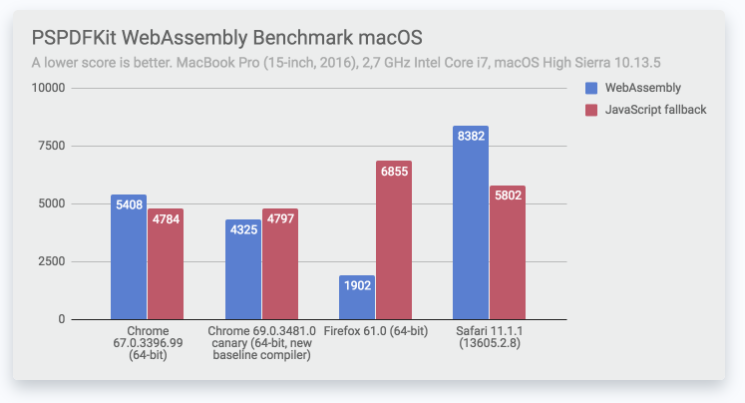
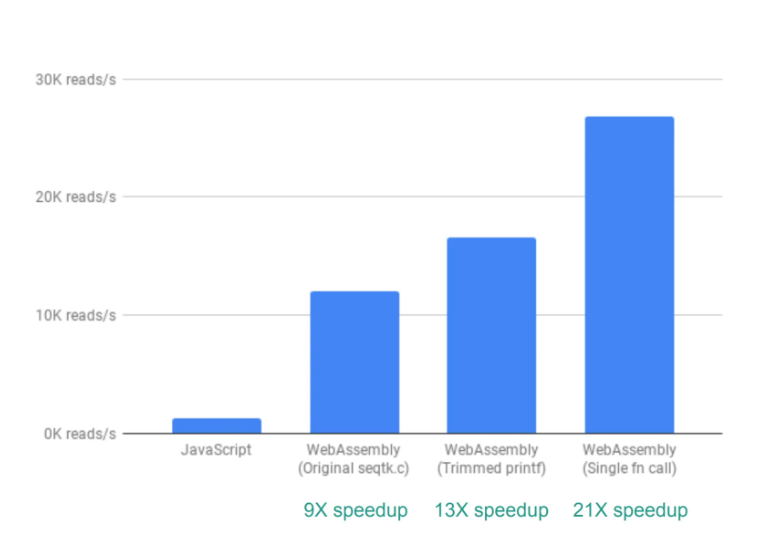

class: center, middle


# WebAssembly, The Good, The Bad, The Ugly


## A short introduction to WebAssembly and discover Blazor features in action.

???
Test

---

# Source

The slide and all materials of this lecuture can be access here in my GitHub:
<br />
<br />
<br />
https://github.com/0x414c49/wasm-blazor-lecture

---

# Introduction

- Introduction to WASM

    > WebAssembly (abbreviated Wasm) is a binary instruction format for a stack-based virtual machine. Wasm is designed as a portable target for compilation of high-level languages like C/C++/Rust, enabling deployment on the web for client and server applications.
     
    > -- https://webassembly.org/

    - Efficient and fast
    - Safe
    - Open and debuggable
    - Part of the open web platform

    And yes, WebAssembly 1.0 has shipped in 4 major browser engines!   

    

---

# Fast and efficient!

* Execute at native speed!
* The binary format is encoded in size and load-time efficient.

# Safe

* Memory Safe!
* Runs inside a sandbox
* It follows rules from JavaScript like same-origin and permissions.

# Open and debuggable

* Designed to be pretty-printed in a textual format
* The textual format will be used when viewing the source of Wasm modules (like source-maps)

---
# Part of the open web platform

* It's a web standard!

---
# Why to use WebAssembly?

- Running in browser means you don't need to care what system it runs on.
--

- Getting people to install an app is actually a pretty significant obstacle to adoption.
--

- There are certain crypto operations that run considerably faster in optimized rust than in browser JS.
--

- JS is actually pretty performance for I/O bound operations, but not ideal for CPU bound operations. WASM let's you use JS for I/O and compiled languages for computation.
--

- Web Assembly will be much simpler to support than JS is.
--

- Some of the most common uses for WebAssembly are going to be image and video editing. Processing video, in particular, can be quite taxing and intensive.

--
- Virtual and Augmented reality applications that require very low latency will benefit from WebAssembly.
--

- Another use case is compiling existing applications to run on the browser. For example, it could be used to compile tools like Photoshop or AutoCAD to run in the browser.
--

- Useful for games and game engines, 3D viewers, computationally expensive dataVis, video players. Doom 3 Engine (http://www.continuation-labs.com/projects/d3wasm/)

---

class: center, middle
# Performance


---

- PDF Generation


---
- Primes and Multiplication


---
- Wasm Runtimes vs Native Rust


---
- SEQTK(DNA Sequence Analyzer)


---
# Blazor

- Almost two years ago, Mono team created `mono-wasm` as the `.NET runtime` on WebAssembly.
--

- https://www.mono-project.com/news/2018/01/16/mono-static-webassembly-compilation/

```
$ cat hello.cs
class Hello {
  static int Main(string[] args) {
    System.Console.WriteLine("hello world!");
    return 0;
  }
}
$ mcs -nostdlib -noconfig -r:../../dist/lib/mscorlib.dll hello.cs -out:hello.exe
$ mono-wasm -i hello.exe -o output
$ ls output
hello.exe        index.html        index.js        index.wasm        mscorlib.dll
```
---
# Blazor

- Steve Sanderson (The guy behind's Knockout.JS) create an experiment project called Blazor.
--

- Blazor = Browser + Razor
--

- At first, the project was a just prof of concept.

---

# Blazor - What is it exactly?

- Blazor is a framework for building interactive client-side web UI with .NET
--

- Create rich interactive UIs using C# instead of JavaScript.
--

- Share server-side and client-side app logic written in .NET.
--

- Render the UI as HTML and CSS for wide browser support, including mobile browsers.
--

---

# .NET for client-side, benefits?

- Using .NET for client-side web development offers the following advantages:

  * Write code in C# instead of JavaScript.
  * Leverage the existing .NET ecosystem of .NET libraries.
  * Share app logic across server and client.
  * Benefit from .NET's performance, reliability, and security.
  * Stay productive with Visual Studio on Windows, Linux, and macOS.
  * Build on a common set of languages, frameworks, and tools that are stable, feature-rich, and easy to use.

---

# Blazor in Action

Let's go!

---

# Conclusion 💡

1. Long road ahead
2. Performance is NOT ALWAYS faster than JS
3. At the moment, even a framework like Blazor still dependant on JS (eg. for geo-location and etc)
4. Already supported by C++, Rust and .NET

# Questions?

# Bye :)